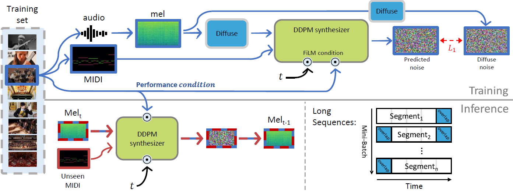

# Performance Conditioning for Diffusion-Based Multi-Instrument Synthesis
[Project Page](https://benadar293.github.io/midipm) for our paper: Maman et al., "Performance Conditioning for Diffusion-Based Multi-Instrument Synthesis", 2023

## Acknowledgments
Parts of this project page were adopted from the [Nerfies](https://nerfies.github.io/) page.

## Website License
 This work is licensed under a <a rel="license" href="http://creativecommons.org/licenses/by-sa/4.0/">Creative Commons Attribution-NonCommercial-ShareAlike 4.0 International (CC BY-NC-SA 4.0)</a>.
